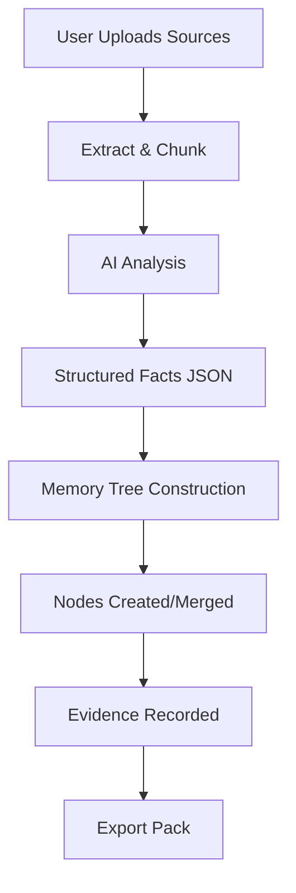
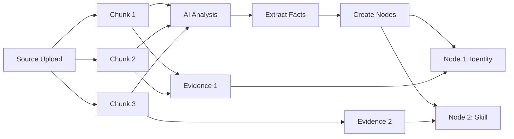
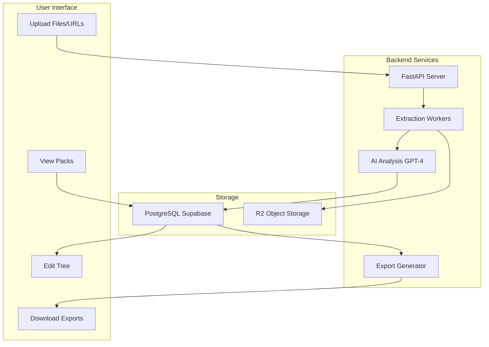
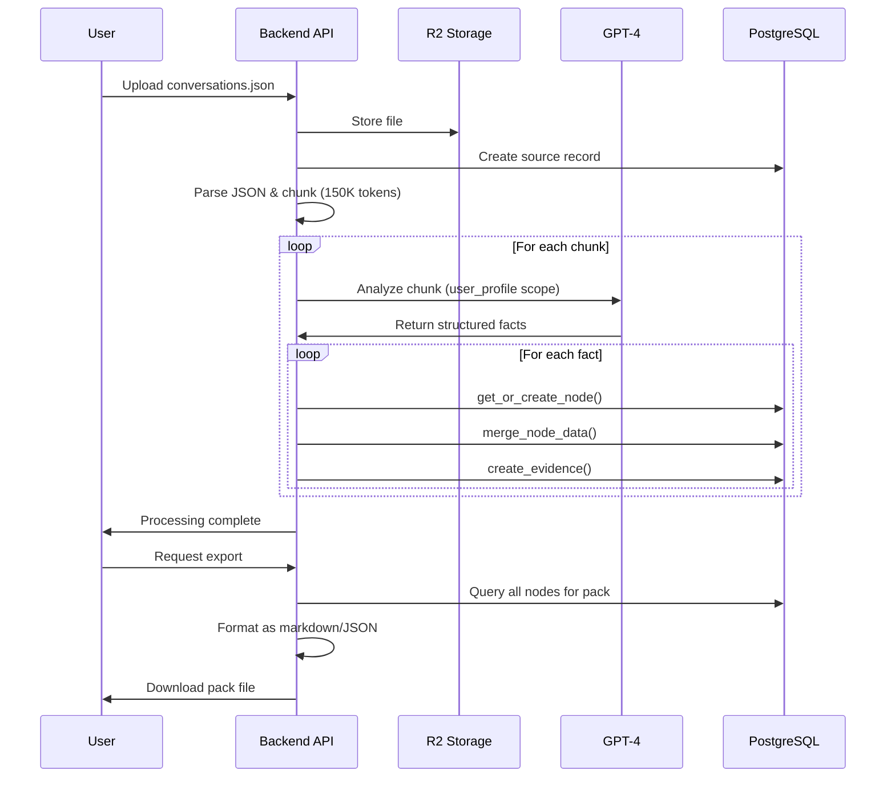

# Architecture Guide: Memory Pointers vs. History Logs

⏱️ **8 MIN READ**

Deep dive into Universal Context Pack's architecture—understand how memory nodes, scopes, evidence tracking, and the extraction pipeline work together.

---

## Table of Contents

1. [Architectural Philosophy](#architectural-philosophy)
2. [Memory Pointers vs. History Logs](#memory-pointers-vs-history-logs)
3. [The Memory Tree System](#the-memory-tree-system)
4. [Node Types and Scopes](#node-types-and-scopes)
5. [Evidence Tracking System](#evidence-tracking-system)
6. [The Extraction Pipeline](#the-extraction-pipeline)
7. [Database Schema](#database-schema)
8. [Data Flow Diagrams](#data-flow-diagrams)

---

## Architectural Philosophy

### The Core Problem

Traditional AI memory systems use **concatenated text**:

```
Conversation 1: "I'm a software engineer..."
Conversation 2: "I prefer React over Vue..."
Conversation 3: "I'm a software engineer at Google..."
Conversation 4: "I use React for most projects..."
```

**Problems**:
- 🔴 **Redundancy**: Same facts repeated multiple times
- 🔴 **No deduplication**: "software engineer" appears twice
- 🔴 **Hard to update**: Can't change just one fact
- 🔴 **Token waste**: Bloated context, higher costs
- 🔴 **No provenance**: Can't track where facts came from

### Our Solution: Structured Memory Graph

Instead of text, we use a **graph of memory nodes**:

```
Node 1: Identity
  data: {name: "...", role: "Software Engineer"}
  evidence: [Conversation 1, Conversation 3]

Node 2: Preference (React)
  data: {text: "Prefers React over Vue"}
  evidence: [Conversation 2, Conversation 4]
```

**Benefits**:
- ✅ **Deduplication**: Each fact stored once
- ✅ **Updatable**: Change one node, effect is global
- ✅ **Efficient**: Minimal redundancy
- ✅ **Provenance**: Evidence links to sources
- ✅ **Maintainable**: Easy to edit/delete specific facts

---

## Memory Pointers vs. History Logs

### History Logs (Traditional Approach)

```
📜 Conversation History
├── Message 1: "I'm a software engineer..."
├── Message 2: "I prefer React..."
├── Message 3: "I'm a software engineer at Google..."
└── Message 4: "I use React for most projects..."

Export: Concatenate all messages → giant text blob
```

**Characteristics**:
- Linear sequence of messages
- Append-only (new messages added to end)
- No structure beyond timestamps
- Full text stored verbatim

### Memory Pointers (UCP Approach)

```
🧠 Memory Tree
├── Identity Node → Points to: [Msg 1, Msg 3]
└── Preference Node → Points to: [Msg 2, Msg 4]

Export: Render nodes with references → structured graph
```

**Characteristics**:
- Graph of atomic facts
- Nodes merge when facts overlap
- Structured by type and scope
- Pointers to evidence sources

### Comparison

| Aspect | History Logs | Memory Pointers |
|--------|-------------|----------------|
| **Storage** | Full message text | Structured facts + evidence links |
| **Redundancy** | High (duplicates everywhere) | Low (facts stored once) |
| **Updates** | Append new message | Merge into existing node |
| **Search** | Text search only | Structured queries by type/scope |
| **Editing** | Can't edit past | Edit specific nodes |
| **Size** | Grows linearly | Grows sub-linearly (dedup) |
| **Cost** | High token usage | Optimized token usage |

---

## The Memory Tree System

### Core Concepts



### Key Components

#### 1. **Nodes**
Atomic facts about the user or knowledge

```python
{
  "id": "node-uuid",
  "user_id": "user-uuid",
  "pack_id": "pack-123",
  "scope": "user_profile",
  "node_type": "Skill",
  "label": "Expert in React",
  "data": {
    "text": "Expert in React with 5 years experience",
    "proficiency": "expert",
    "years": 5
  },
  "created_at": "2026-01-27T12:00:00Z",
  "updated_at": "2026-01-27T12:00:00Z"
}
```

#### 2. **Evidence**
Links nodes to source chunks

```python
{
  "id": "evidence-uuid",
  "node_id": "node-uuid",
  "user_id": "user-uuid",
  "pack_id": "pack-123",
  "source_id": "source-456",
  "chunk_index": 3,
  "snippet": "I've been using React professionally for 5 years..."
}
```

#### 3. **Sources**
Original uploaded files or URLs

```python
{
  "id": "source-uuid",
  "pack_id": "pack-123",
  "filename": "conversations.json",
  "source_type": "chat_export",
  "file_size": 5242880,
  "chunk_count": 12,
  "status": "completed"
}
```

---

## Node Types and Scopes

### Scopes: Organizing Context

UCP uses **scopes** to logically separate different types of context:

#### User Profile Scope

**Identifier**: `user_profile`

**Purpose**: Facts about the user themselves

**Node Types**:
- `Identity`: Name, roles, demographics
- `Preference`: Communication style, tools, workflows
- `Skill`: Technical expertise, proficiency levels
- `Project`: Active work, goals, status
- `Goal`: Objectives, aspirations
- `Constraint`: Limitations, restrictions
- `Fact`: Miscellaneous contextual facts

**Example**:
```
user_profile/
├── Identity: "John Doe, Software Engineer"
├── Preference: "Prefers TypeScript over JavaScript"
├── Skill: "Expert in React"
├── Project: "Building UCP"
└── Goal: "Launch to 1,000 users"
```

#### Knowledge Scopes

**Identifier**: `knowledge:<topic>`

**Purpose**: Facts about specific domains, documents, or topics

**Node Types**:
- `Section`: Document chapters, parts
- `Event`: Timeline events, milestones
- `Entity`: People, places, organizations
- `Concept`: Ideas, definitions, theories
- `Fact`: Domain-specific facts
- `CodePattern`: Programming patterns, idioms

**Example**:
```
knowledge:machine_learning/
├── Section: "Chapter 3: Neural Networks"
├── Concept: "Backpropagation algorithm"
├── Entity: "Geoffrey Hinton - AI researcher"
└── Fact: "CNNs excel at image recognition"
```

### Scope Assignment Logic

```python
def get_scope_for_source(source_type, filename):
    # Chat exports → user_profile
    if source_type == "chat_export":
        return "user_profile"
    
    if "conversations" in filename.lower():
        return "user_profile"
    
    # Documents → knowledge:<topic>
    if filename:
        topic = filename.split('.')[0]  # "ML Paper.pdf" → "ml_paper"
        topic = topic.lower().replace(' ', '_')[:50]
        return f"knowledge:{topic}"
    
    # Fallback
    return "knowledge:generic"
```

---

## Evidence Tracking System

### Why Track Evidence?

**Trust**: Know where each fact came from  
**Verification**: Confirm AI didn't hallucinate  
**Updates**: Re-process sources if needed  
**Debugging**: Understand extraction issues

### Evidence Flow



### Evidence Linking

When a chunk supports multiple nodes:

**Chunk 3 text**:
```
"I'm John, a software engineer with 5 years of React experience.
I prefer functional programming patterns and TypeScript."
```

**Extracted facts**:
1. Identity: "John, software engineer"
2. Skill: "Expert in React (5 years)"
3. Preference: "Functional programming"
4. Preference: "Prefers TypeScript"

**Evidence created**:
```
Evidence 1: Chunk 3 → Identity Node
Evidence 2: Chunk 3 → Skill Node (React)
Evidence 3: Chunk 3 → Preference Node (Functional)
Evidence 4: Chunk 3 → Preference Node (TypeScript)
```

**Result**: One chunk can support many nodes.

### Evidence Viewing

In UCP's tree editor:

```
Node: Expert in React
Type: Skill
Data: {text: "Expert in React", years: 5}

Evidence (2 sources):
  ├── conversations.json (Chunk 3)
  │   "...5 years of React experience..."
  │
  └── linkedin_export.pdf (Page 1)
      "5+ years professional React development"
```

---

## The Extraction Pipeline

### Stage 1: Upload & Parsing

```python
# User uploads file
source = upload_file(file="conversations.json")

# Parse JSON structure
conversations = json.load(file)

# Extract messages
messages = extract_messages_from_chatgpt_format(conversations)
```

### Stage 2: Intelligent Chunking

```python
# Split into chunks (150K tokens each)
chunks = []
current_chunk = []
current_tokens = 0

for message in messages:
    message_tokens = count_tokens(message)
    
    if current_tokens + message_tokens > 150000:
        chunks.append(current_chunk)
        current_chunk = []
        current_tokens = 0
    
    current_chunk.append(message)
    current_tokens += message_tokens

chunks.append(current_chunk)  # Last chunk
```

**Why 150K tokens?**
- Balance of context and cost
- Fits within GPT-4 limits (128K) with room for prompts
- Large enough to capture conversation context
- Small enough to process reliably

### Stage 3: AI Analysis (Per Chunk)

```python
# Determine scope
scope = get_scope_for_source(source.type, source.filename)

# Analyze with GPT-4
prompt = get_analysis_prompt(scope)  # Different prompts for user_profile vs knowledge

response = openai.ChatCompletion.create(
    model="gpt-4",
    messages=[
        {"role": "system", "content": prompt},
        {"role": "user", "content": chunk_text}
    ]
)

# Parse structured response
structured_facts = json.loads(response.content)
```

**Example output** (user_profile scope):
```json
{
  "identity": {
    "name": "John Doe",
    "roles": ["Software Engineer", "Tech Lead"]
  },
  "preferences": [
    "Prefers TypeScript over JavaScript",
    "Values code reviews"
  ],
  "skills": [
    "Expert in React",
    "Proficient in Python"
  ],
  "projects": [
    {
      "name": "Universal Context Pack",
      "description": "AI memory portability",
      "status": "Active"
    }
  ]
}
```

### Stage 4: Memory Tree Construction

```python
def apply_chunk_to_memory_tree(structured_facts, scope, user, pack_id, source_id, chunk_index):
    # Route based on scope
    if scope == "user_profile":
        apply_user_profile_facts(...)
    elif scope.startswith("knowledge:"):
        apply_knowledge_facts(...)

def apply_user_profile_facts(facts, user_id, pack_id, source_id, chunk_index):
    # Process identity (single node)
    if facts.get("identity"):
        node = get_or_create_node(
            scope="user_profile",
            node_type="Identity",
            label="User Identity"
        )
        merge_node_data(node.id, facts["identity"])
        create_evidence(node.id, source_id, chunk_index)
    
    # Process preferences (multiple nodes)
    for pref in facts.get("preferences", []):
        node = get_or_create_node(
            scope="user_profile",
            node_type="Preference",
            label=pref[:120]
        )
        merge_node_data(node.id, {"text": pref})
        create_evidence(node.id, source_id, chunk_index)
```

### Stage 5: Node Merging

When the same fact appears in multiple chunks:

**Chunk 1**:
```json
{"skills": ["Expert in React"]}
```

**Chunk 5**:
```json
{"skills": ["Expert in React", "Proficient in Python"]}
```

**Merging logic**:
```python
def merge_node_data(node_id, new_data):
    current_data = get_node(node_id).data
    
    merged = {}
    for key in set(current_data.keys()) | set(new_data.keys()):
        old = current_data.get(key)
        new = new_data.get(key)
        
        if isinstance(old, list) and isinstance(new, list):
            # Union of lists (no duplicates)
            merged[key] = list(set(old + new))
        elif new is not None:
            # New value overwrites
            merged[key] = new
        else:
            merged[key] = old
    
    update_node(node_id, merged)
```

**Result**:
- Chunk 1 creates node: `{text: "Expert in React"}`
- Chunk 5 finds existing node, merges: `{text: "Expert in React"}` (no change)
- New skill from Chunk 5 creates separate node: `{text: "Proficient in Python"}`

---

## Database Schema

### Core Tables

```sql
-- Packs: User's context collections
CREATE TABLE packs (
    id UUID PRIMARY KEY,
    user_id UUID NOT NULL,
    name VARCHAR(255),
    status VARCHAR(50),
    created_at TIMESTAMP,
    updated_at TIMESTAMP
);

-- Sources: Uploaded files/URLs
CREATE TABLE pack_sources (
    id UUID PRIMARY KEY,
    pack_id UUID REFERENCES packs(id),
    filename VARCHAR(255),
    source_type VARCHAR(50),  -- 'chat_export', 'document', 'url'
    file_size BIGINT,
    chunk_count INTEGER,
    status VARCHAR(50),
    created_at TIMESTAMP
);

-- Memory Nodes: Structured facts
CREATE TABLE memory_nodes (
    id UUID PRIMARY KEY,
    user_id UUID NOT NULL,
    pack_id UUID REFERENCES packs(id),
    scope VARCHAR(255),       -- 'user_profile', 'knowledge:topic'
    node_type VARCHAR(100),   -- 'Identity', 'Skill', 'Preference', etc.
    label VARCHAR(255),       -- Human-readable title
    data JSONB,               -- Flexible structured data
    created_at TIMESTAMP,
    updated_at TIMESTAMP
);

-- Evidence: Links nodes to source chunks
CREATE TABLE memory_evidence (
    id UUID PRIMARY KEY,
    user_id UUID NOT NULL,
    node_id UUID REFERENCES memory_nodes(id),
    pack_id UUID,
    source_id UUID REFERENCES pack_sources(id),
    chunk_index INTEGER,      -- Which chunk in the source
    snippet TEXT,             -- Text excerpt (max 250 chars)
    created_at TIMESTAMP
);
```

### Indexes

```sql
-- Fast lookups by user and pack
CREATE INDEX idx_nodes_user_pack ON memory_nodes(user_id, pack_id);
CREATE INDEX idx_nodes_scope ON memory_nodes(scope);
CREATE INDEX idx_evidence_node ON memory_evidence(node_id);
CREATE INDEX idx_evidence_source ON memory_evidence(source_id);
```

### Row-Level Security (RLS)

```sql
-- Users can only access their own data
ALTER TABLE memory_nodes ENABLE ROW LEVEL SECURITY;

CREATE POLICY nodes_user_isolation ON memory_nodes
    FOR ALL
    USING (user_id = auth.uid());

CREATE POLICY evidence_user_isolation ON memory_evidence
    FOR ALL
    USING (user_id = auth.uid());
```

---

## Data Flow Diagrams

### High-Level System Architecture



### Detailed Processing Flow



---

## Advanced Topics

### Node Deduplication Strategy

**Challenge**: Same fact in multiple chunks

**Solution**: Unique constraint on `(user_id, pack_id, scope, node_type, label)`

```python
# Attempt to create node
try:
    node = create_node(user_id, pack_id, scope, node_type, label)
except UniqueViolationError:
    # Node already exists, fetch it
    node = get_existing_node(user_id, pack_id, scope, node_type, label)

# Merge data (regardless of create vs fetch)
merge_node_data(node.id, new_data)
```

### Handling Conflicts

When merging contradictory facts:

**Chunk 1**: `{location: "San Francisco"}`  
**Chunk 5**: `{location: "New York"}`

**Current strategy**: Latest wins
```python
merged = {location: "New York"}  # Chunk 5 overwrites Chunk 1
```

**Future enhancement**: Track history
```python
merged = {
    location: "New York",
    location_history: ["San Francisco", "New York"],
    updated_at: "2026-01-27"
}
```

### Scalability Considerations

**Current limits**:
- Handles multi-GB files
- 1000s of nodes per pack
- 100s of packs per user

**Optimizations**:
- Batch node creation (reduce DB round-trips)
- Async processing with background workers
- Connection pooling for PostgreSQL
- Caching for frequently accessed nodes

---

## Next Steps

✅ **You understand UCP's architecture!**

Apply this knowledge:
- [ChatGPT Memory Guide](chatgpt-memory-guide.md) - See extraction in action
- [Context Management](context-management.md) - Manage nodes effectively
- [Local Backup](local-backup.md) - Export and understand the tree structure

For developers:
- [Backend Architecture](BACKEND_ARCHITECTURE.md) - Implementation details
- [Database Schema](DATABASE_SCHEMA.md) - Complete schema reference

---

**[← Back to Documentation Hub](index.md)**
