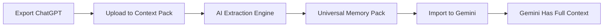

# Import ChatGPT to Gemini: Complete Transfer Guide

**Transfer your ChatGPT conversations to Google Gemini in 5 minutes.** Whether you're switching to Gemini for Google Workspace integration, testing different AI platforms, or want Gemini to understand your ChatGPT conversation history - this guide shows you exactly how.

## Why Import ChatGPT Conversations to Gemini?

**Top Reasons to Switch or Use Both:**

✅ **Google Workspace Integration** - Gemini integrates natively with Gmail, Docs, Sheets, Drive  
✅ **Larger Context Window** - Gemini 1.5 Pro offers 1M+ token context (vs ChatGPT's 128K)  
✅ **Real-Time Information** - Gemini has direct Google Search integration  
✅ **Cost Comparison** - Different pricing models may fit your budget better  
✅ **Feature Testing** - Compare responses between ChatGPT and Gemini  
✅ **Privacy & Data** - Different data policies and infrastructure

**The Problem:** ChatGPT and Gemini don't talk to each other. You can't directly import ChatGPT history into Gemini.

## The Challenge: No Native Import Feature

**What Doesn't Work:**
- ❌ Gemini has no "Import from ChatGPT" button
- ❌ ChatGPT exports are in OpenAI-specific JSON format
- ❌ Gemini can't read ChatGPT's `conversations.json` file
- ❌ Copy-pasting 100+ conversations is impractical
- ❌ Manual summaries lose important context and nuance

**You need a bridge between ChatGPT and Gemini.**

## Method 1: Manual Import (Limited & Time-Consuming)

### Step 1: Export ChatGPT Data

1. **Access ChatGPT Settings**
   - Click profile icon (bottom-left)
   - Go to **Settings** → **Data Controls**

2. **Request Export**
   - Click **Export Data**
   - Confirm request
   - Wait for email (usually arrives within 1-24 hours)

3. **Download & Extract**
   - Click email link
   - Download `.zip` file
   - Extract to find `conversations.json`

### Step 2: Extract Key Information Manually

**Open `conversations.json` and:**
- Read through your chat history
- Copy important conversations
- Manually summarize key points, preferences, context
- Create text notes of what you want Gemini to know

⏱️ **Time Required:** 2-10 hours for significant chat history

### Step 3: Feed Context to Gemini

**Option A: Paste in New Conversation**
```
"Hi Gemini, here's background context from my previous AI conversations:

[Paste summary]

Please remember these preferences and context for our chats."
```

**Option B: Use Gemini's Memory Feature (if available)**
- Manually input key facts into Gemini's memory
- Limited by manual entry effort

**Problems:**
- 💔 Loses conversation structure and nuance
- 🧠 You decide what's "important" (may miss key context)
- 📊 Massive time investment
- ⚠️ Error-prone for large histories

## Method 2: Context Pack - Automated ChatGPT to Gemini Import

**[Context Pack](https://context-pack.com)** automatically transforms your ChatGPT export into a format Gemini can understand - in minutes, not hours.

### How It Works



### Complete Step-by-Step Guide

#### Step 1: Export Your ChatGPT Data

**Quick Method:**
1. Open [ChatGPT](https://chat.openai.com)
2. Click your profile → **Settings** → **Data Controls**
3. Click **Export Data** → Confirm
4. Check your email for the download link (usually within hours)
5. Download the `.zip` file

**What You Get:** `conversations.json` with all your ChatGPT chat history

#### Step 2: Create Your Context Pack

1. **Visit [Context Pack](https://context-pack.com)**
2. **Upload Your Export**
   - Drag and drop the `.zip` file from ChatGPT
   - Or click to select file

3. **AI Processing** (automatic)
   - Context Pack's AI reads your entire chat history
   - Extracts key topics, preferences, insights, and context
   - Distills conversations into portable format
   - Removes platform-specific formatting
   - Optimizes for Gemini compatibility

4. **Review Your Pack**
   - See extracted memories and topics
   - View what Gemini will learn about you

**Processing Time:** 5-10 minutes  
**Free Credits:** 10 credits included (1 conversation ≈ 1-3 credits)

#### Step 3: Import to Gemini

**Method A: Direct Context Import (Recommended)**

1. Open [Google Gemini](https://gemini.google.com)
2. Start a new conversation
3. Paste your Context Pack:

```
"Hi Gemini! I'm transferring my AI conversation history to you. 
Here's my context pack with key information from my previous AI chats:

[Paste Context Pack content]

Please remember this context for all our future conversations. 
Can you confirm you've understood this information?"
```

4. Gemini confirms understanding
5. Continue chatting - Gemini now has your ChatGPT context!

**Method B: NotebookLM Integration**

1. Upload Context Pack to [NotebookLM](https://notebooklm.google.com)
2. Use as persistent source material
3. Reference in Gemini conversations via shared context

**Method C: Gemini Advanced Custom Instructions**

1. If using Gemini Advanced, add Context Pack to custom instructions
2. Gemini will reference in every conversation

### What Gemini Learns From Your ChatGPT Import

**Automatically Extracted:**
- ✅ Communication style and tone preferences
- ✅ Areas of expertise and interest
- ✅ Project context and background
- ✅ Technical preferences (languages, frameworks, tools)
- ✅ Writing style and format preferences
- ✅ Common questions and topics
- ✅ Key facts about your work, projects, or life
- ✅ Preferred response formats

**Result:** Gemini responds as if you've been using it all along

## Real-World Import Examples

### Example 1: Developer Switching to Gemini

**Scenario:** Software developer with 6 months of coding conversations in ChatGPT

**ChatGPT History Included:**
- 150+ coding conversations
- React/TypeScript project context
- Preferred coding style and patterns
- Architecture decisions
- Debugging approaches

**Import Process:**
1. Exported ChatGPT data (1.2GB JSON)
2. Uploaded to Context Pack
3. Received condensed memory pack highlighting:
   - Tech stack preferences (React, TypeScript, Next.js)
   - Code style guidelines
   - Project architecture context
   - Common debugging patterns

4. Imported to Gemini
5. First Gemini conversation: "Help me debug this React component"
   - Gemini immediately suggested solutions matching established coding style
   - Referenced project architecture from ChatGPT history
   - No re-explaining needed

**Time Saved:** 10+ hours of manual context rebuilding

### Example 2: Content Creator Using Both Platforms

**Scenario:** Blogger using ChatGPT for drafts, wants Gemini for Google Docs integration

**ChatGPT History:**
- 300+ content brainstorming sessions
- Brand voice development
- SEO strategy discussions
- Audience insights

**Import Process:**
1. Created Context Pack from ChatGPT export
2. Imported to Gemini
3. Gemini now understands:
   - Brand voice and tone
   - Target audience
   - SEO preferences
   - Content pillars and themes

**Result:** 
- Used ChatGPT for initial drafts
- Switched to Gemini for Google Docs integration
- Both platforms share same brand understanding
- Seamless multi-platform workflow

## ChatGPT to Gemini: Feature Comparison

| Feature | ChatGPT | Gemini | Import Impact |
|---------|---------|--------|---------------|
| **Context Window** | 128K tokens | 1M+ tokens | Import large histories to leverage Gemini's capacity |
| **Google Integration** | ❌ None | ✅ Native | Access Gmail/Docs with ChatGPT context |
| **Real-time Search** | ⚠️ Browsing mode | ✅ Built-in | Research with your ChatGPT preferences |
| **Memory Feature** | ✅ Yes | ⚠️ Limited | Context Pack provides consistent memory |
| **Custom Instructions** | ✅ Yes | ✅ Yes (Advanced) | Import preserves preferences |
| **Pricing** | $20/mo Pro | $20/mo Advanced | Try Gemini without losing ChatGPT investment |

## Import Specific ChatGPT Features to Gemini

### Custom GPTs → Gemini Adaptation

**If you've built Custom GPTs:**
1. Export conversations with your Custom GPT
2. Context Pack extracts:
   - Custom instructions
   - Knowledge base context
   - Interaction patterns
3. Recreate as Gemini custom instructions or NotebookLM sources

### ChatGPT Memory → Gemini Memory

**ChatGPT's Memory feature:**
- ChatGPT remembers facts across conversations
- Not included in standard export

**Solution:**
1. Ask ChatGPT: "List all facts you remember about me"
2. Copy the response
3. Include in Context Pack or paste separately to Gemini
4. Gemini now has equivalent memory layer

### Code Interpreter Projects → Gemini

**For data analysis projects:**
1. Export conversations with code snippets
2. Context Pack preserves:
   - Analysis approach
   - Data structure context
   - Code patterns
3. Continue analysis in Gemini with full context

## Troubleshooting Import Issues

### "Gemini doesn't seem to remember the context"

**Solutions:**
- ✅ Explicitly ask Gemini to confirm understanding after import
- ✅ Reference context pack in first few conversations
- ✅ Use Gemini Advanced custom instructions for persistent memory
- ✅ Break very large context packs into topic-specific sections

### "My ChatGPT export is too large"

**Context Pack handles large exports:**
- AI automatically prioritizes most important context
- Distills 1000+ conversations into digestible memory
- Pricing scales with conversation count

### "Some conversations are private/sensitive"

**Privacy Options:**
1. Use Context Pack's secure processing (no data retention)
2. Manually review extracted pack before import
3. Selectively export specific ChatGPT conversations first
4. Remove sensitive topics from final import

## Advanced: Multi-Platform Strategy

**Don't Choose - Use Both Strategically**

**Optimal Workflow:**
1. Create Context Pack from ChatGPT history
2. Import same pack to both ChatGPT and Gemini
3. Use each platform for its strengths:
   - **ChatGPT:** Creative writing, detailed coding, GPT marketplace
   - **Gemini:** Research, Google Workspace, long context tasks

**Result:** Seamless switching with shared memory foundation

## Import FAQs

**Q: Will Gemini respond exactly like ChatGPT after import?**  
A: No - each AI has unique capabilities and style. The import ensures Gemini understands your *context and preferences*, but responses will reflect Gemini's distinct approach.

**Q: Do I need Gemini Advanced for import?**  
A: No. Import works with free Gemini. Advanced offers custom instructions for persistent memory.

**Q: How often should I update the import?**  
A: Re-import monthly if you're still using ChatGPT actively. Context Pack makes updates quick.

**Q: Can I import from both ChatGPT and Claude to Gemini?**  
A: Yes! Create separate Context Packs or combine exports before processing.

**Q: Will this break any ChatGPT features?**  
A: No. Export is read-only. Your ChatGPT account remains unchanged.

**Q: Is my data safe during import?**  
A: Yes. Context Pack processes securely and doesn't retain your conversations after pack creation.

## Start Your ChatGPT to Gemini Import

**3 Simple Steps:**

1. **[Export ChatGPT data](https://chat.openai.com)** → Settings → Export Data (2 min)
2. **[Create Context Pack](https://context-pack.com)** → Upload export (5 min)
3. **[Import to Gemini](https://gemini.google.com)** → Paste context pack (1 min)

**Total Time:** Under 10 minutes

**[Start Free Import →](https://context-pack.com)** (10 credits included)

---

## Alternative Import Paths

### ChatGPT → Gemini via NotebookLM

**For research-heavy use:**
1. Create Context Pack
2. Upload to NotebookLM as source
3. Reference in Gemini (both Google products)
4. Persistent knowledge base

### ChatGPT → Gemini via Google Docs

**For documentation:**
1. Context Pack to formatted Google Doc
2. Share doc with Gemini in conversation
3. Gemini references doc content

### Selective Conversation Import

**Import specific topics:**
1. Manually select key ChatGPT conversations
2. Copy to text file before export
3. Process smaller, focused Context Pack
4. Targeted Gemini import for specific projects

## Related Guides

- **[Export AI Chat History](https://context-pack.com/export-ai-chat-history)** - Detailed export instructions
- **[Migrate AI Conversations Between Platforms](https://context-pack.com/migrate-ai-conversations)** - Multi-platform strategy
- **[Transfer AI Memory](https://context-pack.com/transfer-ai-memory)** - Advanced memory techniques

---

## Schema Markup

```json
{
  "@context": "https://schema.org",
  "@type": "HowTo",
  "name": "Import ChatGPT to Gemini",
  "description": "Transfer ChatGPT conversations and memory to Google Gemini",
  "step": [
    {
      "@type": "HowToStep",
      "name": "Export ChatGPT Data",
      "text": "Go to ChatGPT Settings > Data Controls > Export Data"
    },
    {
      "@type": "HowToStep",
      "name": "Create Context Pack",
      "text": "Upload ChatGPT export to Context Pack for AI-powered extraction"
    },
    {
      "@type": "HowToStep",
      "name": "Import to Gemini",
      "text": "Paste Context Pack content into Gemini conversation"
    }
  ],
  "tool": {
    "@type": "SoftwareApplication",
    "name": "Context Pack",
    "url": "https://context-pack.com"
  }
}
```
