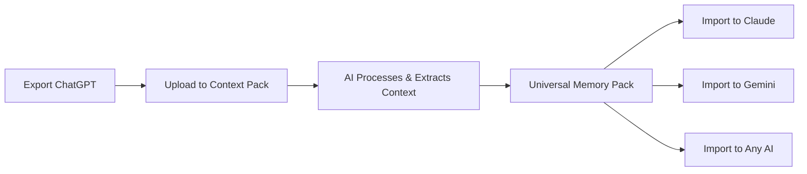

# Migrate AI Conversations Between Platforms: The Complete Guide

**Switch AI platforms without losing your conversation history.** Whether you're moving from ChatGPT to Claude, Gemini to ChatGPT, or trying multiple AI assistants, migrate your conversations seamlessly while preserving context and memory.

## Why Migrate AI Conversations Between Platforms?

**The Multi-AI Reality**
- ChatGPT excels at coding and creative writing
- Claude is superior for analysis and long-form content
- Gemini integrates with Google Workspace
- You need the **right AI for each task** - without starting from scratch

**Common Migration Scenarios:**
- 🔄 **Testing different AI platforms** - Find the best fit without losing work
- 💼 **Work requirements change** - Company switches AI tools
- 🚀 **Feature availability** - New features launch on different platforms
- 💰 **Cost optimization** - Balance free tiers and paid subscriptions
- 🔒 **Privacy concerns** - Move to more private AI platforms

## The Challenge: AI Platforms Don't Talk to Each Other

**Current Reality:**
- ❌ ChatGPT memory doesn't transfer to Claude
- ❌ Gemini can't import Claude conversations
- ❌ Each platform uses proprietary export formats
- ❌ Manual copy-paste loses context and structure
- ❌ Starting fresh means re-explaining everything

**You need a universal bridge between AI platforms.**

## How to Migrate AI Conversations (Traditional Methods)

### Method 1: Manual Export + Import (Limited)

**Step 1: Export from Source Platform**
```
ChatGPT: Settings → Data Controls → Export
Claude: Settings → Export Data
Gemini: Google Takeout
```

**Step 2: Extract Key Information**
- Manually read through JSON exports
- Copy important context
- Summarize key points

**Step 3: Paste into New Platform**
- Start new conversation
- Paste context summary
- Hope the AI understands

**Problems:**
- ⏱️ Takes hours for large conversation histories
- 📉 Loses conversation structure and nuance
- 🧠 No automatic context distillation
- 💔 Platform-specific formatting breaks

### Method 2: Browser Extensions

**Available Tools:**
- AI Chat Exporter
- Save My Chatbot
- Retry in Another AI

**Limitations:**
- Usually export to PDF/Markdown only
- Can't recreate AI memory context
- Platform-specific compatibility
- No intelligent processing

### Method 3: Third-Party AI Workspaces

**Tools like Magai, LibreChat:**
- Centralized interface for multiple AIs
- **BUT:** Still doesn't migrate *existing* conversation history
- Requires using their platform ongoing

## Solution: Context Pack - Universal AI Migration Platform

**[Context Pack](https://context-pack.com)** is the **only tool built specifically for migrating AI conversations between any platforms** while preserving context and memory.

### How Context Pack Migration Works



### Step-by-Step Migration Guide

**1. Export Your Source AI Conversations**
- [Export ChatGPT data](https://context-pack.com/export-ai-chat-history#chatgpt)
- [Export Claude data](https://context-pack.com/export-ai-chat-history#claude)
- [Export Gemini data](https://context-pack.com/export-ai-chat-history#gemini)

**2. Upload to Context Pack**
- Visit [context-pack.com](https://context-pack.com)
- Drag and drop your exported `.zip` file
- Free 10 credits to start (1 conversation ≈ 1-3 credits)

**3. AI Extraction Process**
Context Pack's AI automatically:
- ✅ Extracts key topics, preferences, and context
- ✅ Identifies important memories and insights
- ✅ Distills conversations into portable format
- ✅ Removes platform-specific formatting
- ✅ Optimizes for any target AI platform

**4. Get Your Universal Memory Pack**
- Receive processed context file
- View extracted memories and topics
- Download in universal format

**5. Import to Any AI Platform**
- **ChatGPT:** Paste into Custom Instructions or new chat
- **Claude:** Upload as project knowledge or paste in chat
- **Gemini:** Add to conversation context
- **Any AI:** Works with all major platforms

**Total Time:** 5-10 minutes vs. hours of manual work

## Real Migration Examples

### ChatGPT → Claude Migration

**Use Case:** Developer switching from ChatGPT to Claude for better code analysis

**Before Context Pack:**
- 50+ coding conversations to manually review
- Lost project context and coding preferences
- Had to re-explain architecture every chat

**With Context Pack:**
- Uploaded ChatGPT export
- Context Pack extracted: coding style preferences, project architecture, common debugging patterns
- Imported to Claude in one conversation
- Instant context awareness in new platform

**Time Saved:** 8+ hours

### Gemini → ChatGPT Migration

**Use Case:** Content creator moving from Gemini to ChatGPT for better creative writing

**Before Context Pack:**
- 200+ conversations about brand voice and content strategy
- Manual notes in Google Docs
- Inconsistent context in ChatGPT

**With Context Pack:**
- Exported via Google Takeout
- Processed 3-month conversation history
- Got distilled brand guidelines, tone preferences, audience insights
- ChatGPT immediately understood brand voice

**Result:** Seamless platform switch with preserved creative context

### Multi-Platform AI Strategy

**Use Case:** AI power user leveraging best features of each platform

**Approach:**
1. Create Context Pack from combined ChatGPT + Claude history
2. Universal memory pack holds core context
3. Import same pack into each platform
4. Use ChatGPT for coding, Claude for analysis, Gemini for research
5. All platforms share same memory foundation

## Platform-Specific Migration Guides

### ChatGPT to Claude
[Detailed guide →](https://context-pack.com/import-chatgpt-to-gemini#claude)

### ChatGPT to Gemini
[Detailed guide →](https://context-pack.com/import-chatgpt-to-gemini)

### Claude to ChatGPT
[Detailed guide →](https://context-pack.com/transfer-ai-memory#claude-chatgpt)

### Multi-Platform Setup
[Advanced guide →](https://context-pack.com/transfer-ai-memory#multi-platform)

## Why Context Pack for AI Migration

| Feature | Context Pack | Manual Export | Browser Extensions | Third-Party Workspaces |
|---------|--------------|---------------|-------------------|----------------------|
| **Cross-Platform** | ✅ All platforms | ❌ JSON dumps | ⚠️ Limited | ⚠️ Within tool only |
| **AI-Powered Extraction** | ✅ Smart context | ❌ Raw data | ❌ No processing | ⚠️ Basic |
| **Preserves Memory** | ✅ Distilled insights | ❌ Lost context | ❌ Text only | ⚠️ Platform-dependent |
| **Speed** | ✅ 5-10 min | ❌ Hours | ⚠️ Medium | ⚠️ Requires setup |
| **Privacy** | ✅ Secure, no retention | ✅ Local | ⚠️ Varies | ⚠️ Stored externally |
| **Free Option** | ✅ 10 credits free | ✅ Free | ⚠️ Some free | ❌ Usually paid |

## Migration FAQs

**Q: Will my conversations work the same on a different AI platform?**  
A: Each AI has unique strengths, but Context Pack ensures the target AI understands your history, preferences, and context.

**Q: Can I migrate to multiple platforms at once?**  
A: Yes! One Context Pack works across all platforms. Create once, use everywhere.

**Q: How much conversation history can I migrate?**  
A: Context Pack handles exports of any size. Pricing is based on conversation count (1 conversation ≈ 1-3 credits depending on length).

**Q: Is my data secure during migration?**  
A: Yes. Context Pack uses secure processing and doesn't retain your conversations after pack creation.

**Q: Do I need to migrate everything or can I be selective?**  
A: You can upload full exports and Context Pack intelligently extracts the most important context. For selective migration, you can export specific conversations first.

**Q: Will the target AI "remember" my history?**  
A: The Context Pack provides essential memory and context. The AI will understand your preferences, past discussions, and key information as if you'd been using it all along.

## Start Your AI Migration Today

**3 Simple Steps:**

1. **[Export your current AI data](https://context-pack.com/export-ai-chat-history)** (2 minutes)
2. **[Create your Context Pack](https://context-pack.com)** (5 minutes)
3. **Import to any AI platform** (1 minute)

**[Start Free Migration →](https://context-pack.com)** (10 free credits included)

---

## Advanced: Multi-AI Workflow Strategy

**The New Reality:** Use the best AI for each task

**Optimal Setup:**
1. Create master Context Pack from all platforms
2. Maintain universal memory layer
3. Use specialized AIs for specific tasks:
   - **ChatGPT:** Coding, technical docs
   - **Claude:** Analysis, writing, research
   - **Gemini:** Google Workspace integration
   - **Perplexity:** Real-time research

**All platforms share the same memory foundation via Context Pack.**

## Schema Markup

```json
{
  "@context": "https://schema.org",
  "@type": "SoftwareApplication",
  "name": "Context Pack",
  "applicationCategory": "AI Migration Tool",
  "description": "Migrate AI conversations between ChatGPT, Claude, Gemini, and other platforms",
  "offers": {
    "@type": "Offer",
    "price": "0",
    "priceCurrency": "USD",
    "description": "10 free credits included"
  },
  "featureList": [
    "Cross-platform AI migration",
    "AI-powered context extraction",
    "Universal memory format",
    "Privacy-first processing"
  ]
}
```
