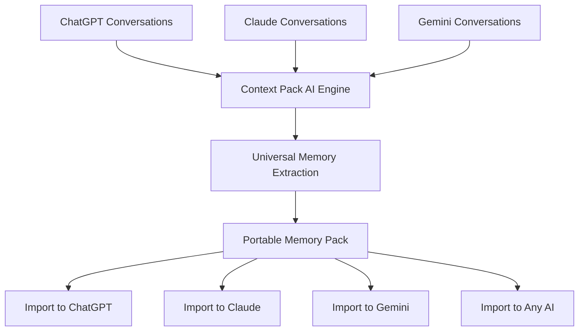

# Transfer AI Memory: Make Your AI Assistant Memory Portable

**Your AI should remember you - no matter which platform you use.** Transfer AI memory between ChatGPT, Claude, Gemini, and other assistants. Switch platforms, upgrade accounts, or use multiple AIs while maintaining continuous memory and context.

## What is AI Memory?

**AI Memory** is how modern AI assistants remember information about you across conversations:

**Types of AI Memory:**
- 💭 **Personal Preferences** - Communication style, tone, formality level
- 🛠️ **Technical Context** - Programming languages, frameworks, tools you use
- 📊 **Project Knowledge** - Ongoing work, business context, objectives
- 🎯 **Interests & Expertise** - Topics you frequently discuss
- 📝 **Response Formats** - How you prefer information presented
- 🧠 **Past Interactions** - Previous conversation context and decisions

**Examples:**
- ChatGPT remembers you're a React developer and always suggests TypeScript
- Claude knows your writing style and matches it in drafts
- Gemini recalls your business context for strategic questions

## The AI Memory Portability Problem

**Current Reality: Memory is Locked to Each Platform**

```
You: "Help me with this React component"

ChatGPT: Remembers your TypeScript preference, project architecture, coding style
         → Provides perfectly contextualized help

[You switch to Claude]

You: "Help me with this React component"  

Claude: Has NO context about your preferences, project, or style
        → Asks basic questions, gives generic advice
        → You must re-explain everything
```

**The Problem:**
- ❌ ChatGPT memory doesn't transfer to Claude
- ❌ Claude can't access Gemini's knowledge about you
- ❌ Switching platforms = starting from scratch
- ❌ Multiple AI accounts = fragmented memory
- ❌ Account upgrades lose conversation history

**You need portable AI memory that works everywhere.**

## Why Transfer AI Memory?

### Use Case 1: Platform Switching
**Scenario:** Moving from ChatGPT to Claude

**Without Memory Transfer:**
- Lose months of built-up context
- Re-explain preferences, projects, style
- Lower quality responses initially
- Time wasted on onboarding

**With Memory Transfer:**
- Claude instantly knows your context
- Immediate high-quality responses
- Seamless transition
- Zero re-explanation needed

### Use Case 2: Multi-Platform Strategy
**Scenario:** Use different AIs for different tasks

**The Goal:**
- ChatGPT for coding
- Claude for analysis and writing  
- Gemini for Google Workspace integration
- All platforms share the same memory of you

**Without Memory Transfer:**
- Fragmented understanding across platforms
- Constantly re-explaining context
- Inconsistent AI responses

**With Memory Transfer:**
- Universal memory layer across all AIs
- Each platform knows your full context
- Optimized multi-AI workflow

### Use Case 3: Account Migration
**Common Scenarios:**
- Work → Personal account
- Free → Paid tier
- Team account changes
- Regional account switches

**Without Memory Transfer:**
- Lose all conversation history
- Memory resets to zero
- Start relationship from scratch

**With Memory Transfer:**
- Preserve accumulated knowledge
- Instant context in new account
- Continuous AI experience

### Use Case 4: Backup & Continuity
**Protect Your AI Investment:**
- Platform goes down / account issues
- Preserve months/years of context
- Insurance against data loss
- Maintain AI relationship continuity

## Platform-Specific Memory Systems

### ChatGPT Memory

**How It Works:**
- Automatically remembers facts across conversations
- Stored in "Memory" you can view/edit
- Persists indefinitely until deleted
- Applies to all conversations (except temporary chats)

**View ChatGPT Memory:**
```
Method 1: Settings → Personalization → Memory → View
Method 2: Ask ChatGPT: "What do you remember about me?"
```

**Export ChatGPT Memory:**
1. Go to Settings → Data Controls → Export Data
2. Download includes `conversations.json` with history
3. **Note:** Separate memory feature not directly exportable
4. **Workaround:** Ask ChatGPT to list all memories

**Limitations:**
- Platform-locked (can't transfer to Claude/Gemini)
- Export doesn't include formatted memory separately
- Manual extraction required for transfer

### Claude Memory (Projects)

**How It Works:**
- "Projects" feature stores context and knowledge
- Add custom instructions and knowledge per project
- Conversations within projects share context

**Claude Memory Approach:**
- More manual than ChatGPT
- User-controlled knowledge bases
- Project-specific contexts

**Export Claude Context:**
1. Settings → Export Data (for conversations)
2. Manually copy Project knowledge if set up
3. Extract key context from conversation history

### Gemini Memory

**Current Status:**
- Limited persistent memory compared to ChatGPT
- Relies heavily on conversation context window
- Can reference Google Workspace data

**Gemini Context Strategy:**
- Use custom instructions (Gemini Advanced)
- Leverage NotebookLM for persistent knowledge
- Rely on large context window (1M+ tokens)

**Export Options:**
- Google Takeout for conversation data
- Manual extraction of key preferences

### Other AI Platforms

**Perplexity, Claude Sonnet, DeepSeek, etc.:**
- Most have basic conversation history
- Limited cross-conversation memory
- Platform-specific export methods

## How to Transfer AI Memory (Methods)

### Method 1: Manual Memory Transfer

**Step 1: Extract Memory from Source AI**

**For ChatGPT:**
```
Prompt: "Please list every fact and preference you remember about me, 
organized by category (technical preferences, communication style, 
projects, interests, etc.)"
```

**For Claude (via Projects):**
- Copy project instructions and knowledge manually
- Export conversations and extract key insights

**For Gemini:**
- Ask for context summary
- Review conversation history for key preferences

**Step 2: Format Memory for Transfer**

Create organized notes:
```markdown
## Technical Preferences
- Primary language: Python
- Frameworks: Django, React
- Prefers TypeScript over JavaScript

## Communication Style
- Direct, concise responses
- Code examples preferred
- Bullet points over paragraphs

## Project Context
- Building SaaS product for [industry]
- Tech stack: [details]
- Current focus: [area]

## Interests
- [Topics]
```

**Step 3: Import to Target AI**

**ChatGPT Custom Instructions:**
- Settings → Personalization → Custom Instructions
- Paste formatted memory

**Claude Project Knowledge:**
- Create new Project
- Add memory as project knowledge

**Gemini:**
- Start conversation with memory context
- Or use Gemini Advanced custom instructions

⏱️ **Time Required:** 1-3 hours for comprehensive memory  
⚠️ **Accuracy:** Depends on manual extraction quality

### Method 2: Context Pack - Automated AI Memory Transfer

**[Context Pack](https://context-pack.com)** automates AI memory extraction and transfer across all platforms.

#### How Context Pack Transfers AI Memory



#### Step-by-Step Memory Transfer

**Step 1: Export Source AI Data**

**ChatGPT:**
- Settings → Data Controls → Export Data
- Download `.zip` file

**Claude:**
- Settings → Export Data
- Download export

**Gemini:**
- Google Takeout → Select Gemini
- Download archive

**Step 2: Upload to Context Pack**

1. Visit [context-pack.com](https://context-pack.com)
2. Drag and drop your AI export file
3. Start with 10 free credits

**Step 3: AI Memory Extraction**

Context Pack's AI automatically:
- ✅ Analyzes all conversations
- ✅ Identifies recurring preferences and patterns
- ✅ Extracts technical context and project knowledge
- ✅ Distills communication style preferences
- ✅ Organizes memories by category
- ✅ Creates universal memory format
- ✅ Optimizes for target AI platform

**Processing Time:** 5-10 minutes

**Step 4: Review Extracted Memory**

Context Pack shows:
- Key memories and preferences
- Topic clusters
- Technical context
- Communication patterns

**Step 5: Transfer to Any AI Platform**

**Universal Memory Pack works with:**
- ✅ ChatGPT (Custom Instructions or conversation)
- ✅ Claude (Project Knowledge or conversation)
- ✅ Gemini (Custom Instructions or conversation)
- ✅ Any other AI assistant

**Import Methods:**

**Option A: Custom Instructions**
- Paste memory pack into AI's custom instructions
- Applied to all future conversations

**Option B: Conversation Context**
- Start new chat with memory pack
- AI confirms understanding
- Continue with full context

**Option C: Knowledge Base**
- Upload to NotebookLM, Claude Projects, etc.
- Reference as needed

## Advanced Memory Transfer Strategies

### Strategy 1: Universal Memory Layer

**Create master memory that works across all AIs:**

1. **Combine Platform Exports**
   - Export from ChatGPT, Claude, Gemini
   - Upload all to Context Pack

2. **Create Master Memory Pack**
   - Context Pack merges insights
   - Removes duplicates
   - Creates comprehensive memory

3. **Import Everywhere**
   - Same memory pack to all platforms
   - Universal AI understanding
   - Consistent experience across platforms

**Result:** All your AIs share the same knowledge about you

### Strategy 2: Project-Specific Memory

**Different memory packs for different contexts:**

**Work Projects:**
- Export work-related conversations
- Create "Professional Context Pack"
- Import only to work AI accounts

**Personal Projects:**
- Export personal conversations  
- Create "Personal Context Pack"
- Keep separate from work

**Creative Work:**
- Export creative/writing conversations
- Create "Creative Context Pack"
- Import to AI used for content

**Benefit:** Segmented, context-appropriate memory

### Strategy 3: Incremental Memory Updates

**Keep AI memory current:**

1. **Monthly Refresh**
   - Export latest conversations
   - Create updated Context Pack
   - Re-import to AIs

2. **Event-Based Updates**
   - After major project milestones
   - When preferences change
   - After learning new technologies

**Result:** AI memory stays synchronized with your evolution

### Strategy 4: Multi-Account Synchronization

**Same memory across multiple accounts:**

**Use Cases:**
- Work and personal ChatGPT accounts
- Free and paid tiers
- Team accounts with individual context

**Approach:**
1. Create Context Pack from primary account
2. Import to all secondary accounts
3. Update periodically

## AI Memory Transfer Comparison

| Method | Time | Accuracy | Cross-Platform | Ongoing Sync | Cost |
|--------|------|----------|----------------|--------------|------|
| **Manual Export** | 1-3 hrs | ⚠️ Variable | ⚠️ Platform-dependent | ❌ Manual effort | Free |
| **Copy-Paste Conversations** | Many hours | ❌ Low | ❌ Format issues | ❌ Impractical | Free |
| **Context Pack** | 5-10 min | ✅ AI-powered | ✅ Universal | ✅ Easy refresh | ~Free start |
| **Third-Party Workspaces** | Setup time | ⚠️ Limited | ⚠️ Within tool only | ⚠️ Tool-specific | Usually paid |

## Real-World Memory Transfer Examples

### Example 1: Developer Switching to Claude

**Background:**
- 8 months of ChatGPT coding conversations
- Built-up context: tech stack, coding style, project architecture

**Challenge:**
- Wanted to try Claude for better code analysis
- Didn't want to lose ChatGPT's understanding

**Solution:**
1. Exported ChatGPT data
2. Created Context Pack
3. Imported to both ChatGPT and Claude

**Result:**
- Claude immediately understood:
  - Preferred languages (Python, TypeScript)
  - Code style preferences (Airbnb style guide, type hints)
  - Project architecture (microservices, Django backend)
  - Common debugging approaches
- Seamless platform switch
- Used both AIs for different strengths with shared memory

### Example 2: Multi-Platform Content Creator

**Background:**
- Used ChatGPT for content drafts
- Used Claude for analysis
- Used Gemini for Google Docs integration
- Fragmented understanding across platforms

**Challenge:**
- Each AI had incomplete picture
- Constantly re-explaining brand voice
- Inconsistent quality across platforms

**Solution:**
1. Combined exports from all platforms
2. Created master Context Pack with:
   - Brand voice and tone
   - Target audience insights
   - Content pillars
   - SEO preferences
3. Imported same pack to all three AIs

**Result:**
- **ChatGPT:** Writes in consistent brand voice
- **Claude:** Analyzes content with brand context
- **Gemini:** Edits in Google Docs with same understanding
- Optimized multi-AI workflow with universal memory

### Example 3: Account Migration After Company Change

**Background:**
- 12 months of work conversations in company ChatGPT account
- Left company, lost access to account
- Started personal ChatGPT account

**Challenge:**
- Lost all built-up professional context
- Personal account had no knowledge of:
  - Technical expertise
  - Communication preferences
  - Project frameworks

**Wish They Had:**
1. Exported company account data before leaving
2. Created Context Pack from exports
3. Imported to personal account

**Outcome (if done):**
- Preserved professional context
- Personal account immediately productive
- Continuous AI assistant relationship

**Lesson:** Export and backup AI memory regularly

## Memory Transfer FAQs

**Q: What exactly gets transferred when I transfer AI memory?**  
A: Preferences, communication style, technical context, project knowledge, recurring topics, and interaction patterns. Specific conversation details are distilled into portable context.

**Q: Will the target AI respond identically to the original?**  
A: Each AI has unique capabilities, but with transferred memory, the target AI will understand your context and preferences as deeply as the original did.

**Q: How often should I update transferred memory?**  
A: Monthly for active users, or after significant changes in your work, preferences, or projects.

**Q: Can I transfer memory between different account types (free → paid)?**  
A: Yes. Context Pack creates platform-agnostic memory that works across account types and tiers.

**Q: Is it possible to selectively transfer only certain memories?**  
A: Yes. You can review extracted memories and choose what to include in the final transfer pack.

**Q: Will transferring memory affect my original AI account?**  
A: No. Export and transfer are read-only operations. Your original AI account remains unchanged.

**Q: How secure is AI memory during transfer?**  
A: Context Pack uses secure processing and doesn't retain your conversations or memory after pack creation.

**Q: Can I merge memory from multiple AI platforms?**  
A: Yes. Upload exports from multiple platforms and Context Pack creates a unified memory pack.

## Start Transferring Your AI Memory

**Make your AI memory portable in 3 steps:**

1. **[Export your AI data](https://context-pack.com/export-ai-chat-history)** (2 min)
2. **[Create your Context Pack](https://context-pack.com)** (5 min)
3. **Import to any AI platform** (1 min)

**[Transfer Memory Now →](https://context-pack.com)** (10 free credits)

---

## The Future: Portable AI Memory Standard

**The Vision:**
- AI memory as a portable file format
- Move between platforms like contacts or calendar
- Universal AI interoperability
- Your AI understands you everywhere

**Today:** Context Pack makes this vision real

**Start building your portable AI memory today.**

---

## Related Guides

- **[Export AI Chat History](https://context-pack.com/export-ai-chat-history)** - How to export from each platform
- **[Migrate AI Conversations](https://context-pack.com/migrate-ai-conversations)** - Full conversation migration
- **[Import ChatGPT to Gemini](https://context-pack.com/import-chatgpt-to-gemini)** - Specific platform transfer

---

## Schema Markup

```json
{
  "@context": "https://schema.org",
  "@type": "FAQPage",
  "mainEntity": [
    {
      "@type": "Question",
      "name": "What is AI memory transfer?",
      "acceptedAnswer": {
        "@type": "Answer",
        "text": "AI memory transfer is the process of moving an AI assistant's knowledge about you - including preferences, context, and conversation history - from one platform to another, ensuring continuity of your AI experience."
      }
    },
    {
      "@type": "Question",
      "name": "How do I transfer ChatGPT memory to Claude?",
      "acceptedAnswer": {
        "@type": "Answer",
        "text": "Export your ChatGPT data, use Context Pack to extract and format the memory, then import to Claude via custom instructions or project knowledge."
      }
    }
  ]
}
```
